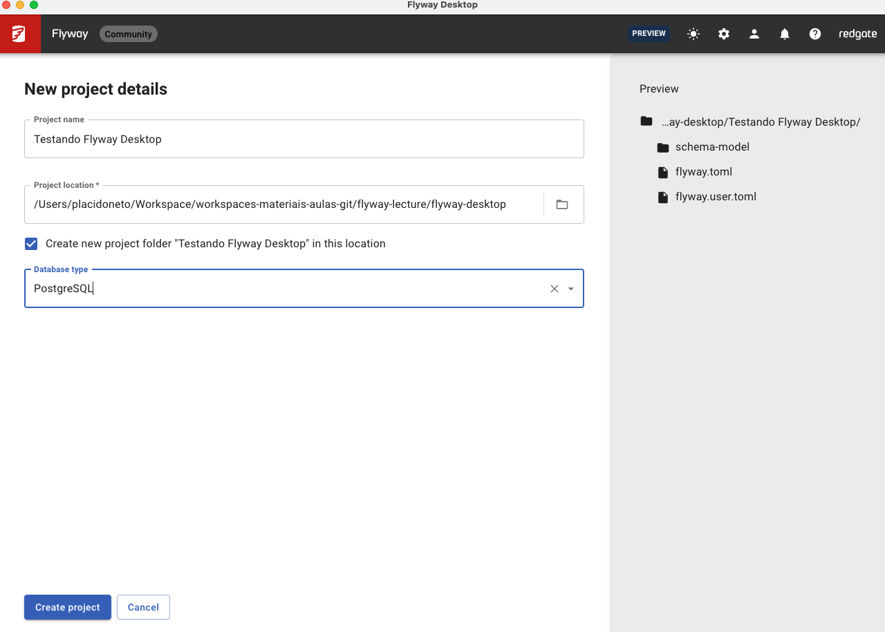

# Desenvolvimento com FlayWay (ORM <-> Banco de Dados Relacional)


Flyway ajuda a versionar mudanças em banco de dados e automatizar implantações seguras de maneira simples.


O cenário inicial no uso do Flyway é um banco de dados vazio. 

## Histórico de Tabelas com Flyway

O Flyway mantém um controle rigoroso do histórico de mudanças no banco de dados através de uma tabela especial chamada `flyway_schema_history`.

### Como Funciona o Controle de Versão

Quando você executa o Flyway pela primeira vez, ele cria automaticamente a tabela `flyway_schema_history` que armazena:

- **version**: Número da versão do script
- **description**: Descrição da migração
- **type**: Tipo da migração (SQL, Java, etc.)
- **script**: Nome do arquivo de migração
- **checksum**: Hash do conteúdo do script
- **installed_by**: Usuário que executou a migração
- **installed_on**: Data e hora da execução
- **execution_time**: Tempo de execução em milissegundos
- **success**: Se a migração foi executada com sucesso

### Estrutura dos Arquivos de Migração

Os scripts seguem uma convenção de nomenclatura:
```
V1__Create_person_table.sql
V2__Add_people_table.sql
V3__Add_index_to_people.sql
```


Esta tabela é usada para manter as mudanças de banco.

### Como o Flyway Aplica as Migrações

O Flyway irá escanear o sistema de arquivos ou o classpath da aplicação em busca de migrações. Elas podem ser escritas em SQL, Java, ou outras linguagens de script.

As migrações são aplicadas em ordem baseada em seu número de versão:


## Flyway Desktop

Após a instalação do Flyway Desktop, temos alguns passos importantes a seguir:

### Passo a Passo: Usando Flyway Desktop

#### 1. **Instalação e Configuração Inicial**
- Baixe e instale o Flyway Desktop do site oficial
- Inicie a aplicação
- Configure a conexão com seu banco de dados através da interface gráfica

#### 2. **Criando um Novo Projeto**
- Clique em "New Project" ou "Criar Novo Projeto"
- Selecione o tipo de banco de dados (PostgreSQL, MySQL, SQL Server, etc.)

- Forneça um nome descritivo para seu projeto
- Escolha o diretório onde os arquivos serão armazenados




- Configure os parâmetros de conexão:
    - Host e porta
    - Nome do banco
    - Usuário e senha

#### 3. **Estrutura de Diretórios**
O Flyway Desktop criará automaticamente:
```
projeto/
├── migrations/
│   ├── V1__Initial_schema.sql
│   └── V2__Add_users_table.sql
└── flyway.conf
```

#### 4. **Criando Migrações**
- Use o botão "New Migration" para criar novos scripts
- Nomeie seguindo o padrão: `V[versão]__[descrição].sql`
- Escreva seu SQL no editor integrado

#### 5. **Executando Migrações**
- **Info**: Visualize o status atual das migrações
- **Migrate**: Execute migrações pendentes
- **Validate**: Verifique a integridade dos scripts
- **Clean**: Remove todos os objetos do schema (apenas desenvolvimento)

#### 6. **Monitoramento**
- Acompanhe o progresso na aba "History"
- Visualize logs de execução
- Verifique erros e sucessos

#### 7. **Versionamento em Equipe**
- Commits no Git incluem os scripts de migração
- Sincronize com outros desenvolvedores
- Execute `flyway info` para verificar status antes de migrar

#### 8. **Boas Práticas**
- Nunca modifique scripts já executados
- Use transações quando possível
- Faça backup antes de grandes mudanças
- Teste migrações em ambiente de desenvolvimento primeiro